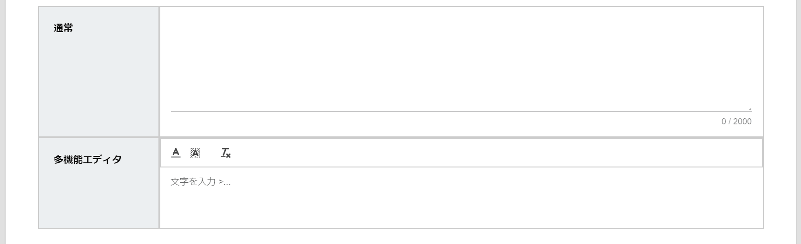
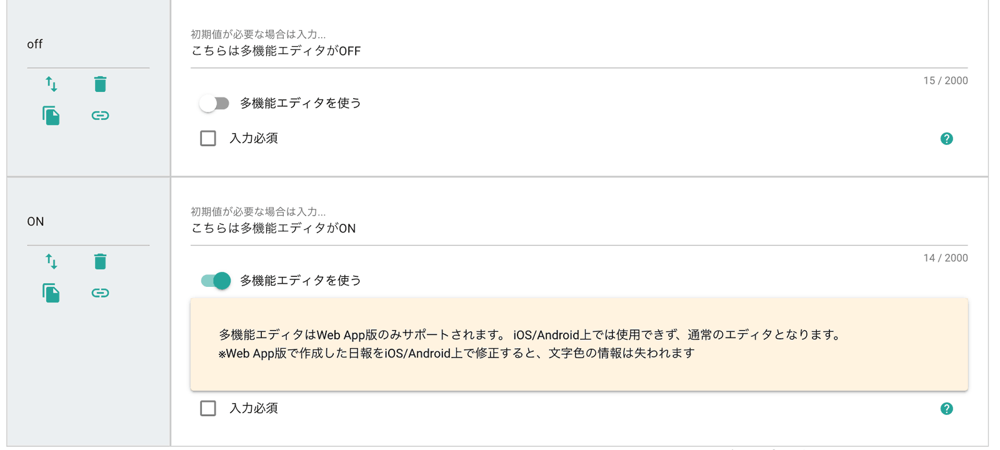

# 複数行テキスト

通常よく使われる、普通のテキスト入力エリアです。文字の入力や色変え・マスクがけなどができます。「業務内容」や「ひきつぎ」など、さまざまな項目として使える最も一般的な項目と言えます

::: tip
- 初期値の設定
- 検索の対象
- 入力必須の指定
:::

## 複数行テキストの種類
「多機能エディタを使う」をONにすることで、多機能エディタが有効になります。多機能エディタを使うことで文字に色を付けたり、マスクがけをすることが可能になります。（多機能エディタはWebアプリ版のみ対応)
