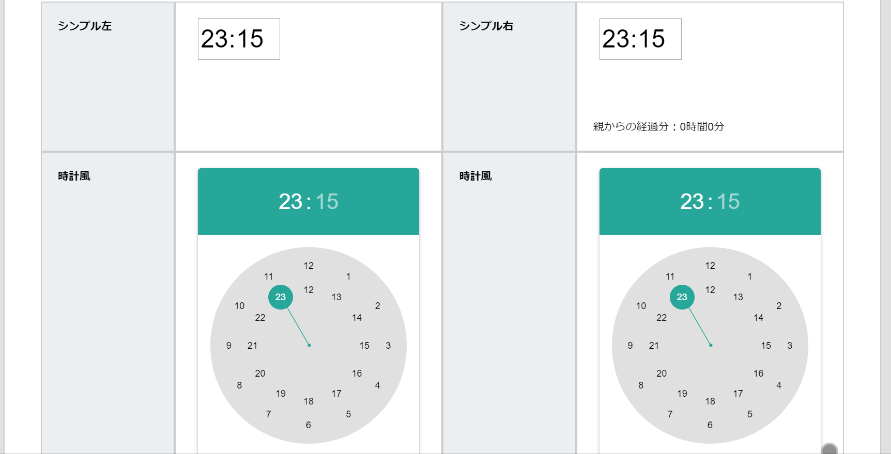
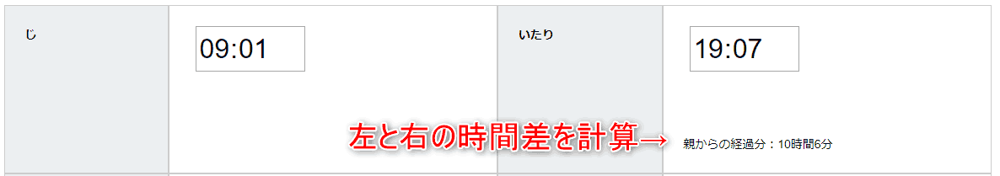

# 時刻

時刻入力は2種類あります。上図をご覧ください。
アナログ時計から選択するやり方と、ブラウザ依存から選ぶことができます。  
ブラウザ依存の場合は使用するブラウザによって入力方式が変わります。（例えばiPhoneのSafariならドラム式の入力になる）  
日報作成時の時刻が初期値として設定されるため、初期値の設定はできません。また、時刻パーツを連結して2つ並べると、双方の時間差を自動で計算します

::: warning 非対応
- 検索の対象
- 入力必須の指定
- 初期値の設定
:::