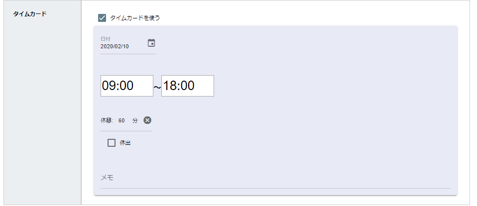
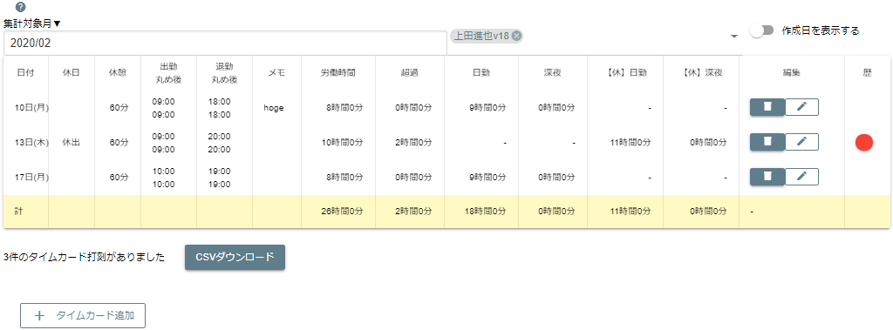

# タイムカード
  

タイムカードは出退勤時間の入力に特化したパーツです。時刻パーツを2つ並べるよりもシンプルで使いやすいパーツです。  
他のパーツと異なり、タイムカードは1つのテンプレートに付き1つまでしか設定できません。  
また、タイムカードに入力されたデータは[タイムカードシート](/manual/timecard/use)として集計されます。  

  

タイムカードは日報内にも記載されますが、1か月単位で集計をすることができます。  
打刻修正や時刻の丸めなどもオマケ程度についています。なおタイムカードの集計は別途有料となります（月額ではなく売り切りです）
