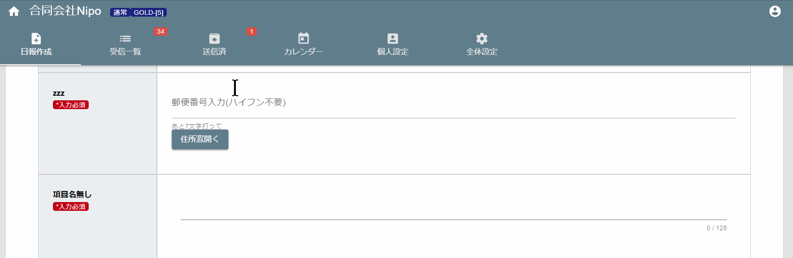

# 郵便番号▶住所入力（郵便番号から簡単に住所入力可）<Badge text="GOLD限定" type="error" />

7桁の郵便番号を入力するだけで、市や町まで入力を補完します。  
例えば郵便番号「3291105」と入力すると、「栃木県宇都宮市中岡本町」まで取得できます。  
入力は全角でも半角でもOKです。ハイフンは不要です。住所入力の手間を減らすのに便利なパーツですね。
郵便番号がわからない場合は諦めて手動で住所を入力してください。