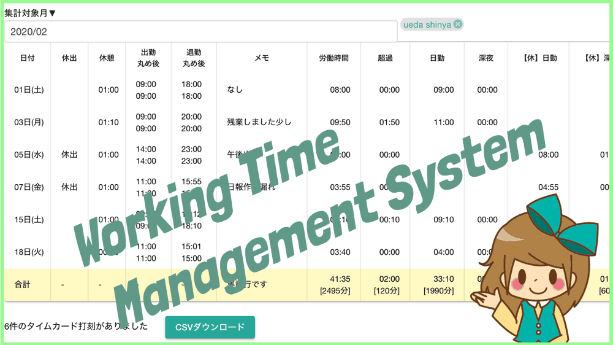

# タイムカード機能<Badge text="一部有料" type="warning" />

## タイムカード（勤怠管理）機能を使う
タイムカードとは、従業員の労働時間を把握するための打刻システムです。実際に紙に印字するものもあれば、バーコードで入力するタイプのものや、キーボードで直接入力するものなど様々なタイプがあります。  
入力の方式は様々ですが、タイムカードの目的は「従業員の労働時間を把握する」ということです。タイムカードに記載された時間をもとに労働時間が計算されます。  
計算も、社労士へ依頼する場合もあれば、自社内で計算する場合もあるでしょう。  
Drecoという勤怠管理システムのサービスが終了を迎えるにあたり、「Nipoでタイムカード管理機能をつけてほしい」というリクエストをいただき、この度Nipoでタイムカード機能が実装されました。  
Drecoの全ての機能を実装しているわけでは有りませんが、簡易版の勤怠管理機能があれば十分というのであれば、是非ご検討ください。  

### タイムカード機能を有効化する
初期状態ではタイムカード機能が無効になっています。タイムカード機能を有効化してください  
全体設定から「タイムカード」のスイッチをONにするだけで有効化されます

### テンプレートにタイムカードパーツを埋め込む
Nipoでタイムカードを利用するには、日報テンプレートに[タイムカードパーツ](/manual/template/timecard)を追加します。  
複数のテンプレートを使い分けている場合は、１日１回以上使用されるテンプレートにタイムカードパーツを付けることをおすすめします。  
例えば「月報」と「日報」があれば、この場合「日報」にタイムカードパーツを付けてください。

### タイムカードの管理者を決める
誰でも自由に全員のタイムカードを操作できる状況はあまり望ましくありません。  
Nipoでは一般の方は自分のタイムカードに対してのみ、「作成」「閲覧」「修正」が可能です。  
それとは別に、全員のタイムカードを見たり修正したりできる管理者が必要になるはずです。（グループの管理者とは別です）  
タイムカードの管理者は「全体設定」のメンバー管理から設定できます

タイムカード管理者は、以下のことができるようになります

- 出勤退勤時間の丸め（端数処理）など、設定に関する全て
- 自分以外のタイムカード閲覧（通常は自分以外のタイムカードは閲覧できません）
- タイムカードの削除

## タイムカードに関する丸めなどの設定を行う<Badge text="応用編" type="warning" />
此処から先は応用編です。いつでも変更可能なので、少し慣れてからでも問題ありません。  
出勤時間の丸め、退勤時間の丸めや、超過労働の基準時間を設定できます。この設定は前述した「タイムカード管理」に設定されたスタッフしか操作できません。

設定はオートセーブです。変更すると即時保存され、集計結果は自動で再計算されます。

### 各日で端折りについて
指定した時間単位でタイムカードの値を丸めることができます。出勤時と退勤時の２種類でそれぞれ設定可能です。
出勤時の端折りでは、指定した刻み時間まで出勤時間が遅れます。
例えば８時４１分にタイムカードが押されたとして、出勤時の切り上げを１０分とした場合、集計上の値は８時５０分となります（９分切り上げられる）

退勤時の端折りでは、指定した刻み時間まで退勤時間が早まります。  
例えば１８時１３分にタイムカードが押されたとして、退勤時の切り下げを１０分とした場合、集計上の値は１８時１０分となります（３分切り捨てられる）

### 合計の端折りについて
集計した期間の合計値に対して、切り下げを行います。例えば３月２１日〜４月２０日までの合計労働時間が１８１時間５１分で、切り下げを３０分とした場合、集計上の値は１８１時間３０分となります。（２１分の切り捨て）

### １日あたりの超過時間
１日にこの基準を超えると超過労働となり、集計上の「超過」に値が蓄積されます。単位は「分」となり、初期値は４８０分です。（８時間＝４８０分）

### 締日の設定<Badge text="要アンロック" type="warning" />
この機能はアンロックが必要です
指定した日付を締日として、集計期間を自動セットします。初期値は月末です。
「５日・１０日・１５日・２０日・２５日・月末」から選択できます。例えば２５日を選択すると、当月の２６日〜翌月の２５日までの期間で集計が行われます

### タイムカードのデータをエクセルで開く
「CSVダウンロード」ボタンをクリックすると表示されているタイムカードのデータがそのままCSVでダウンロードできます。

::: warning
日勤・夜勤列はそれぞれ滞在時間を表すだけで、休憩時間は引かれません。しかし【総時間】からは休憩時間が引かれます。違いに注意して下さい。
:::

## タイムカード機能のアンロックについて
全ての機能が無料で利用可能ですが、タイムカードの集計に表示される日報は7件までとなります。超過分については表示されません。  
この上限を解除するには、タイムカード機能のアンロックを購入していただく必要があります。  
アンロックは売り切りのため、一度の購入で永続的に（Nipoのサービスが終わるまで）ご利用可能です。  
お支払いは現在、請求書発行による口座振込のみとなります。