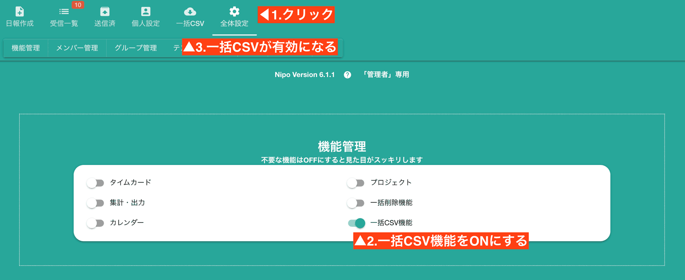
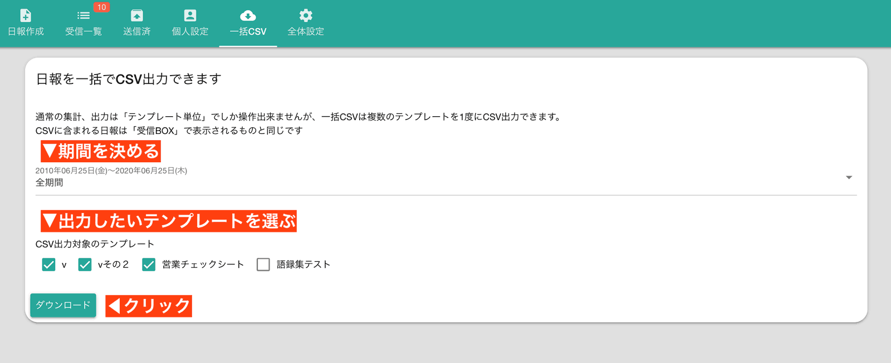
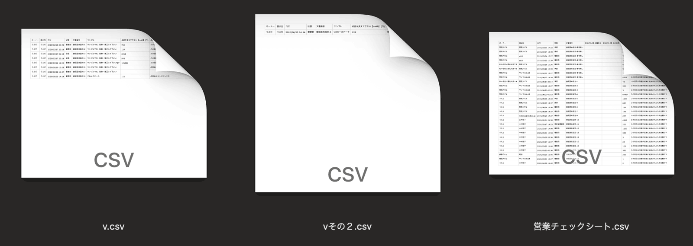
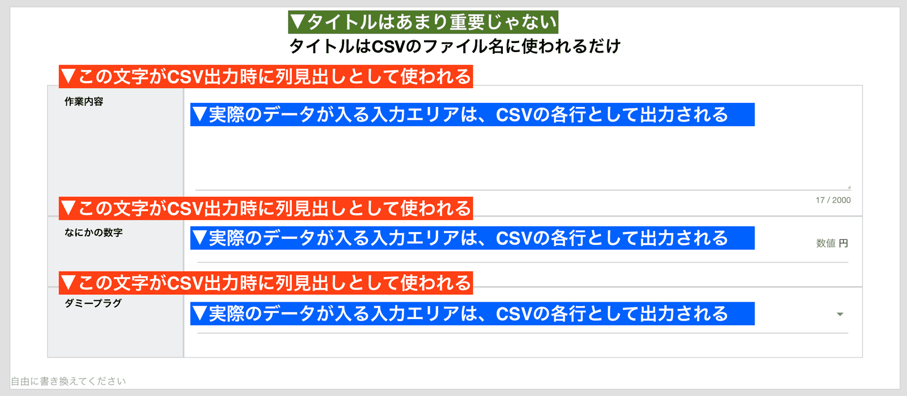

# すべての日報を一括でCSV出力<Badge text="一部GOLD限定" type="warning" />

::: tip こちらもチェック
類似機能に[集計・分析機能](/manual/utility/analyze)があります。
:::
## CSV一括出力とは
通常の[集計機能](/manual/utility/analyze)から取得できるCSVは１種類のテンプレートしか取得出来ません。テンプレートが10種類あると、10回同じ操作が必要となり、あまりにも非効率的です  
一括CSV出力はこの問題を解決するために実装されました。  
Aというテンプレートで書かれた日報も、Bというテンプレートで書かれた日報も、全て一度にCSVとしてダウンロードできます。 
<Alice label="面倒くさい！って思う気持ちが便利を生み出します。" /> 

## CSV一括出力を有効化する  

CSV一括出力は初期状態で無効化されています。全体設定から「機能管理」の項目を見つけて、**一括CSV機能**を有効にしてください。  
詳しい手順は下図のとおりです  

## 一括CSVを使ってみる  

この機能は目的が１つしかないため、画面が非常にシンプルです。設定項目は
- 書き出したい期間
- 書き出したいテンプレートの種類

の2種類だけです。設定を済ませたら「ダウンロード」ボタンをクリックしてください

ダウンロードされたファイルは「csv.zip」という名前になっています。  
このZipファイルを開くと、中にはテンプレートごとに分けられたCSVファイルが格納されています  
  
<Alice label="テンプレートによって項目がバラバラだから、CSVも分けて出力されるよ" icon="pc" />

## 複数のCSVファイルを1つに連結する<Badge text="応用編"/>
同じ形のテンプレートを複数種類使っている場合は、これらを1つのCSVにきれいに連結することも可能です。  
例えば[テンプレートのコピー機能](/manual/template/_import)を使って同じテンプレートを複数使う場合などに有効です。
ここからはNipoではなく、弊社が無償で提供している[CSV連結ツール](/column/csvsc.html)を使ったやり方になります。  
<Alice label="CSVはただの文字データなので、他にもやり方は色々あるよ" icon="ok" />

さて、CSVSCは複数のCSVを登録したとき、1行目の列見出しに注目します。列見出しが同じ文字であれば、CSVSCは両者を同じ列と認識します。  
NipoではCSVに出力する際、1行目の列見出しは、日報テンプレートの各見出しに相当するため、見出しの名前が一致していれば同じ列として出力可能です  
  
<Alice label="上の図で言う、赤色の箇所さえ揃えればいいってことだね" icon="ok" />
 