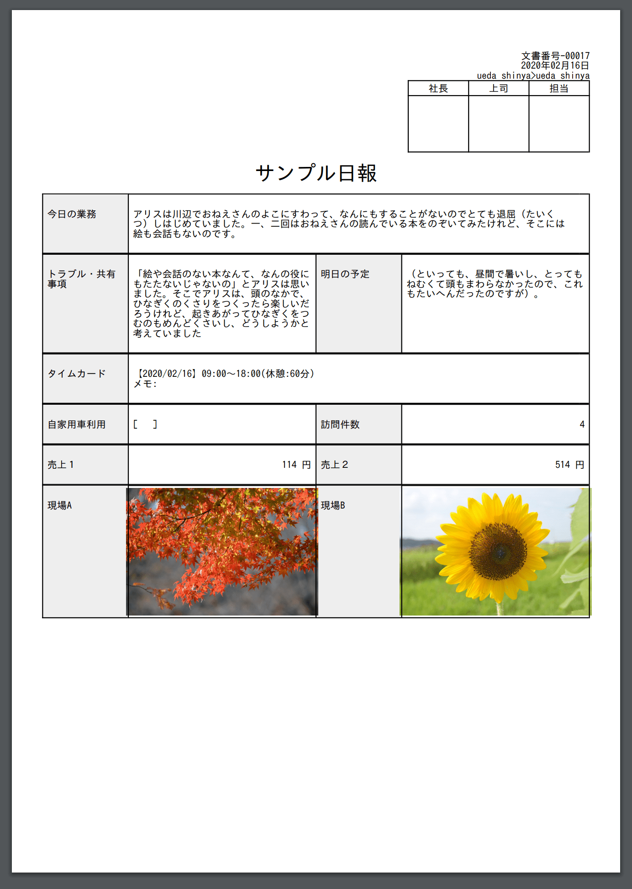
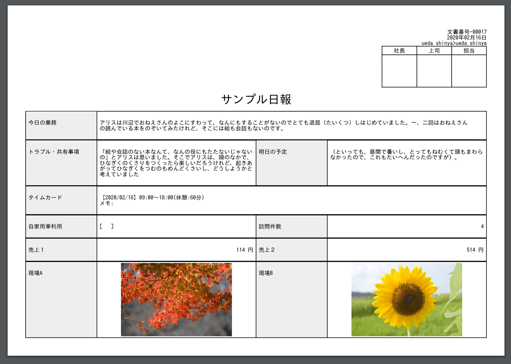
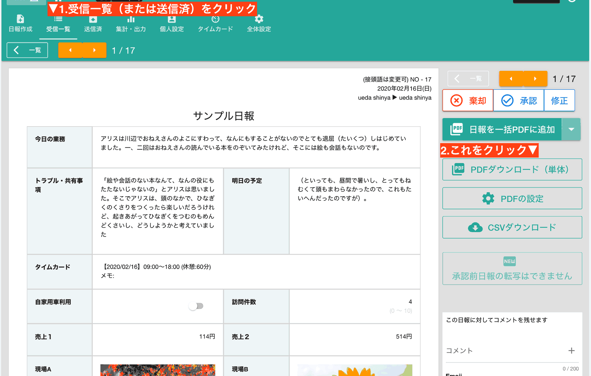
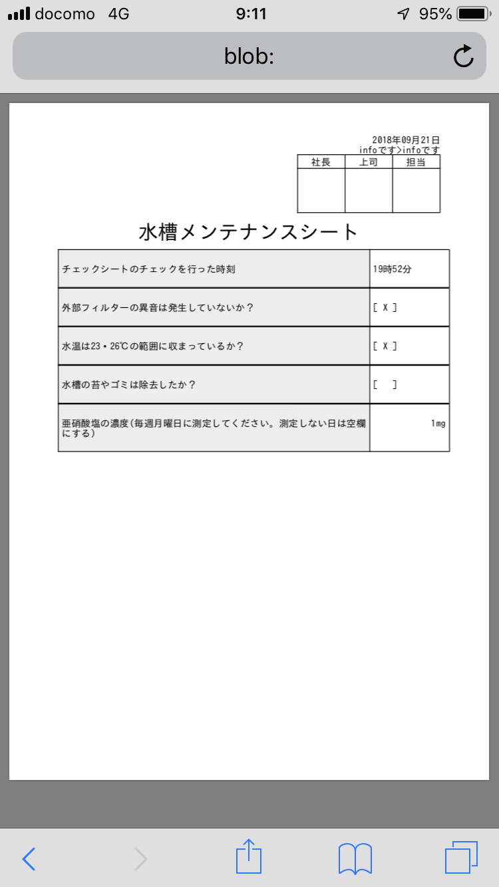

# 日報をPDFへ変換できます。スマホからもOK<Badge text="GOLD限定" type="error" />

Nipoの大きな特徴の1つにPDF変換があります。日報アプリで作成された日報をワンクリックでかんたんにPDFへ変換できます。  
スマートフォンやタブレットからも直接変換可能です。PDF表示可能なアプリがあればそのまま表示もできます。

## 出力される日報の実際のPDFデータです

日報テンプレートのデザインを崩さずにそのままPDFに変換できます。サイズは最も一般的なA4です。  
出力の向きを変更すれば「A4縦」または「A4横」として出力が可能です。上のサンプルは全く同じ内容の日報ですが、向きが変わることで見え方も結構変わる様子が伺えます

## PDFのメリット
PDFファイルは日報ととても相性が良いです。なぜならPDFの持つ特徴と日報の用途がマッチしているからです。PDFの特徴をちょっとリストアップしてみました。
- 印刷してもレイアウトが崩れない
- 電子署名することで改ざんを防止できる
- メールで送信ができる

ビジネスのシーンに着目すると、「請求書」や「見積書」といったファイルをメールで送る際、PDF化されたものを送ることがおおいでしょう。なぜなら上記のメリットにより、「請求書」などはPDFが適しているためです。内容の書き換えもWordに比べて行いにくいのも特徴です。PDFは読み取り専用。永久保存としての側面が強いため、ビジネス文書（日報も含めて）ととても相性が良いのです。

::: warning
専用ソフトを使って編集は可能のため、改ざんを100%防ぐわけではありません。
改ざんを防ぐには電子署名をつける必要があります
:::

## PDFに変換する手順
日報をPDF化するのは簡単です。
「**PDF化したい日報を表示してPDFダウンロードボタンをクリック**」これだけです。

### 複数の日報を一括でPDFに変換、ZIPでダウンロードできます
複数の日報やチェックシートをまとめてPDFに変換してダウンロードするには、PDF化したい日報を表示して「日報を一括PDFに追加」ボタンをクリックします。

ある程度リストに追加したら、▼ボタン（下向きの三角アイコン）をクリックし、「ダウンロード」ボタンを押して下さい。
1件しか追加されていない場合はPDFファイルとしてダウンロードされますが、2件以上追加した場合は、自動でZIPファイルに纏められてダウンロードされます。
::: warning
一括PDFダウンロードはWebアプリ版でのみ利用可能です。Android/IOS版では利用できません
:::

### PDFに出力する前にいろいろ設定してみよう
PDF変換前に様々な設定ができます。この設定は「テンプレート単位で保存される」ことに留意して下さい。例えば「月報用テンプレート」と「日報用テンプレート」がある場合、「日報用テンプレート」の設定を変更すると全ての「日報用テンプレート」で作成されたファイルに対してに同じ設定が適用されます。

さて、「PDFの設定」をクリックすると現在表示中のテンプレートに対する設定ができます。

**用語解説**

- チェックシート式
  - 出力するPDFが「チェックシート風」のレイアウトに変わります(設問幅が長くなる)
- 見出し項目に色付け
  - /デフォルトでONです。OFFにすると設問全ての背景が「白」になります
- コメント
  - コメントが付いていた場合にそのコメントもPDFに含めて出力します
- 日付
  - 右上に配置される日報作成日を表示するか設定できます
- 作者と宛名
  - 日報作成者と宛名をPDFに表示するか設定できます
- 接頭語と文書番号
  - 右上に配置される文書番号をPDFに表示するか設定できます
- 検印欄
  - ONにすると検印欄に配置する名前を入力できます。上限はありませんが多すぎると紙面をはみ出しますので注意して下さい
- 文字サイズ
  - 3段階から選べます
- 項目名の幅
- 項目名の幅を微調整できます。3段階から選べます
- ページの余白
  - 1ページに収まらない場合は「狭い」にして下さい
- 印刷の向き
  - 縦・横から選択してください。実際の例は本ページ上部に掲示しています。
- 透かし文字
  - PDF文書に透かし（ウォーターマーク）が入れられます。紫色です
- 設定を保存
  - このボタンを押すと指定した設定が保存されます。PDFの設定を保存すれば、次回以降はボタン1つで同じ設定でPDF化できます。
  - 保存しないで1枚だけPDF出力することも可能です。設定はグループのメンバー全員に適用されます
- PDF出力
  - 表示されている日報をそのままPDFに出力します
- Back
  - 日報画面へ戻ります

::: tip
PDF設定画面では出力される日報の本文自体も変更可能です。本文自体の変更は保存されずPDF出力後にもとの日報の文章に戻ります
:::

## PDF化された日報をコンピュータに保存
PDF出力をすると、あなたのPCに日報PDFが保存されます。
Windows/Macでご利用の際、ファイル名は「nipo-20180921_11時54分.pdf」のようになります。  
日付がファイル名になるわけですが、この日付は「日報が提出された日時」となります。

スマートフォン専用アプリでも、PDF変換が利用できます。  
画像はiPhone 8から日報をPDFに変換した様子です。  
画面は小さくても、ちゃんとPDFになっていますね。  
このあとは、メールに添付して送信したり、プリンターがつながっていればそのまま印刷したり。  
アプリによっては、メッセンジャーアプリに添付することも可能です
上図は、開発者上田のiPhone 8を使ってPDF変換を行った様子です。ファイル名など一部PC版と挙動が異なります。

::: warning
AndroidはLolipop以前だと正常に動作しません。iOSは最新版でご利用ください
:::

### 日報をPDF化する上での注意事項や制限について
PDFに変換するとき、いくつかの「お約束」があります。

一般的に使用される文字、記号が利用できます。ひらがな・カタカナの他、ローマ数字なども利用できます。
漢字についてはJIS第一水準でサポートされている漢字は全てサポートしております。[JIS第一水準](https://kanjitisiki.com/jis1/)についてはこちらを御覧ください。  
サポート対象外の文字を利用すると、PDF化した際に・（中黒）として表示されます  

::: tip サポートされている特殊文字
JIS第一水準に含まれず、お客様からご要望のあった以下の漢字がサポートされています
【藝框澤諫廣邨條氣翔淺錢稟厦邊邉絨毯遽】
:::

- 数値パーツの補助科目については印刷の対象外です。
- チェックボックスはWeb上のデザインと異なる形で印刷されます。具体的には、チェックアリの場合、[ x ]と印刷されます。チェックが無い場合、空欄の[ ]になります。
- A4用紙1枚に収まらない場合、複数枚に分けてPDF化されます
- 日報本文中の「マスク掛け」は適用されません