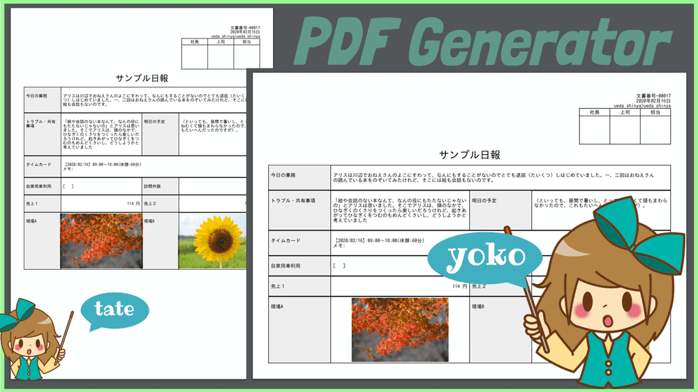

# 日報をPDFへ変換できます。スマホからもOK<Badge text="GOLD限定" type="error" />

Nipoの大きな特徴の1つにPDF変換があります。日報アプリで作成された日報をワンクリックでかんたんにPDFへ変換できます。  
スマートフォンやタブレットからも直接変換可能です。PDF表示可能なアプリがあればそのまま表示もできます。

## 出力される日報の実際のPDFデータです

日報テンプレートのデザインを崩さずにそのままPDFに変換できます。サイズは最も一般的なA4です。  
出力の向きを変更すれば「A4縦」または「A4横」として出力が可能です。上のサンプルは全く同じ内容の日報ですが、向きが変わることで見え方も結構変わる様子が伺えます

## PDFのメリット
PDFファイルは日報ととても相性が良いです。なぜならPDFの持つ特徴と日報の用途がマッチしているからです。PDFの特徴をちょっとリストアップしてみました。
- 印刷してもレイアウトが崩れない
- 電子署名することで改ざんを防止できる
- メールで送信ができる

ビジネスのシーンに着目すると、「請求書」や「見積書」といったファイルをメールで送る際、PDF化されたものを送ることがおおいでしょう。なぜなら上記のメリットにより、「請求書」などはPDFが適しているためです。内容の書き換えもWordに比べて行いにくいのも特徴です。PDFは読み取り専用。永久保存としての側面が強いため、ビジネス文書（日報も含めて）ととても相性が良いのです。

::: warning
専用ソフトを使って編集は可能のため、改ざんを100%防ぐわけではありません。
改ざんを防ぐには電子署名をつける必要があります
:::

## PDFに変換する手順
日報をPDF化するのは簡単です。
「**PDF化したい日報を表示してPDFダウンロードボタンをクリック**」これだけです。

## PDF化された日報をコンピュータに保存
PDF出力をすると、あなたのPCに日報PDFが保存されます。
Windows/Macでご利用の際、ファイル名は「nipo-20180921_11時54分.pdf」のようになります。  
日付がファイル名になるわけですが、この日付は「日報が提出された日時」となります。

スマートフォン専用アプリでも、PDF変換が利用できます。  
画像はiPhone 8から日報をPDFに変換した様子です。  
画面は小さくても、ちゃんとPDFになっていますね。  
このあとは、メールに添付して送信したり、プリンターがつながっていればそのまま印刷したり。  
アプリによっては、メッセンジャーアプリに添付することも可能です
上図は、開発者上田のiPhone 8を使ってPDF変換を行った様子です。ファイル名など一部PC版と挙動が異なります。

::: warning
AndroidはLolipop以前だと正常に動作しません。iOSは最新版でご利用ください
:::

### 日報をPDF化する上での注意事項や制限について
PDFに変換するとき、いくつかの「お約束」があります。

一般的に使用される文字、記号が利用できます。ひらがな・カタカナの他、ローマ数字なども利用できます。
漢字についてはJIS第一水準でサポートされている漢字は全てサポートしております。[JIS第一水準](https://kanjitisiki.com/jis1/)についてはこちらを御覧ください。  
サポート対象外の文字を利用すると、PDF化した際に・（中黒）として表示されます  

::: tip サポートされている特殊文字
JIS第一水準に含まれず、お客様からご要望のあった以下の漢字がサポートされています
【藝框澤諫廣邨條氣翔淺錢稟厦邊邉絨毯遽】
:::

- 数値パーツの補助科目については印刷の対象外です。
- チェックボックスはWeb上のデザインと異なる形で印刷されます。具体的には、チェックアリの場合、[ x ]と印刷されます。チェックが無い場合、空欄の[ ]になります。
- A4用紙1枚に収まらない場合、複数枚に分けてPDF化されます
- 日報本文中の「マスク掛け」は適用されません