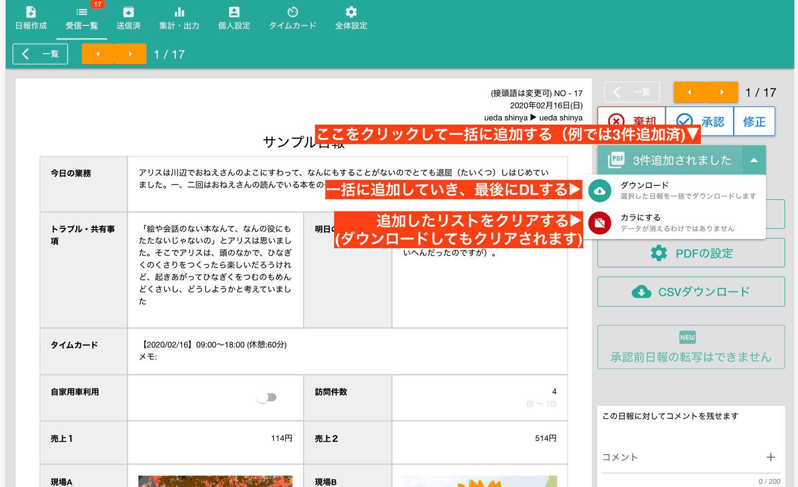

# 複数の日報を一括でPDFに変換、ZIPでダウンロードできます<Badge text="GOLD限定" type="error" />
複数の日報やチェックシートをまとめてPDFに変換してダウンロードするには、PDF化したい日報を表示して「日報を一括PDFに追加」ボタンをクリックします。

ある程度リストに追加したら、▼ボタン（下向きの三角アイコン）をクリックし、「ダウンロード」ボタンを押して下さい。
1件しか追加されていない場合はPDFファイルとしてダウンロードされますが、2件以上追加した場合は、自動でZIPファイルに纏められてダウンロードされます。
::: warning
一括PDFダウンロードはWebアプリ版でのみ利用可能です。Android/IOS版では利用できません
:::

::: tip
PDF設定画面では出力される日報の本文自体も変更可能です。本文自体の変更は保存されずPDF出力後にもとの日報の文章に戻ります
:::
