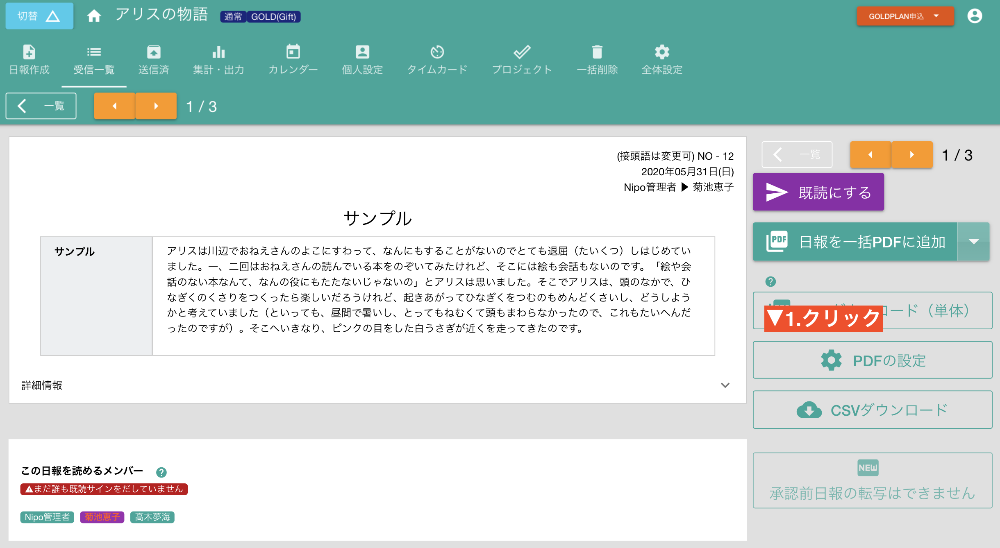
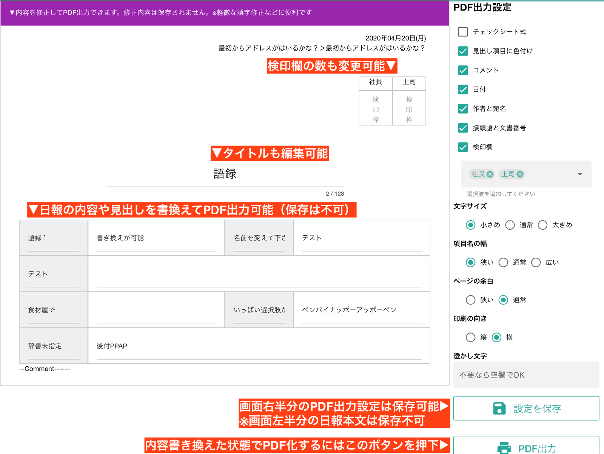

# PDFに出力する前にいろいろ設定してみよう<Badge text="GOLD限定" type="error" />
PDF変換前に様々な設定ができます。この設定は「テンプレート単位で保存される」ことに留意して下さい。例えば「月報用テンプレート」と「日報用テンプレート」がある場合、「日報用テンプレート」の設定を変更すると全ての「日報用テンプレート」で作成されたファイルに対してに同じ設定が適用されます。

さて、「PDFの設定」をクリックすると現在表示中のテンプレートに対する設定ができます。

**用語解説**

- チェックシート式
  - 出力するPDFが「チェックシート風」のレイアウトに変わります(設問幅が長くなる)
- 見出し項目に色付け
  - /デフォルトでONです。OFFにすると設問全ての背景が「白」になります
- コメント
  - コメントが付いていた場合にそのコメントもPDFに含めて出力します
- 日付
  - 右上に配置される日報作成日を表示するか設定できます
- 作者と宛名
  - 日報作成者と宛名をPDFに表示するか設定できます
- 接頭語と文書番号
  - 右上に配置される文書番号をPDFに表示するか設定できます
- 検印欄
  - ONにすると検印欄に配置する名前を入力できます。上限はありませんが多すぎると紙面をはみ出しますので注意して下さい
- 文字サイズ
  - 3段階から選べます
- 項目名の幅
- 項目名の幅を微調整できます。3段階から選べます
- ページの余白
  - 1ページに収まらない場合は「狭い」にして下さい
- 印刷の向き
  - 縦・横から選択してください。実際の例は本ページ上部に掲示しています。
- 透かし文字
  - PDF文書に透かし（ウォーターマーク）が入れられます。紫色です
- 設定を保存
  - このボタンを押すと指定した設定が保存されます。PDFの設定を保存すれば、次回以降はボタン1つで同じ設定でPDF化できます。
  - 保存しないで1枚だけPDF出力することも可能です。設定はグループのメンバー全員に適用されます
- PDF出力
  - 表示されている日報をそのままPDFに出力します
- Back
  - 日報画面へ戻ります
