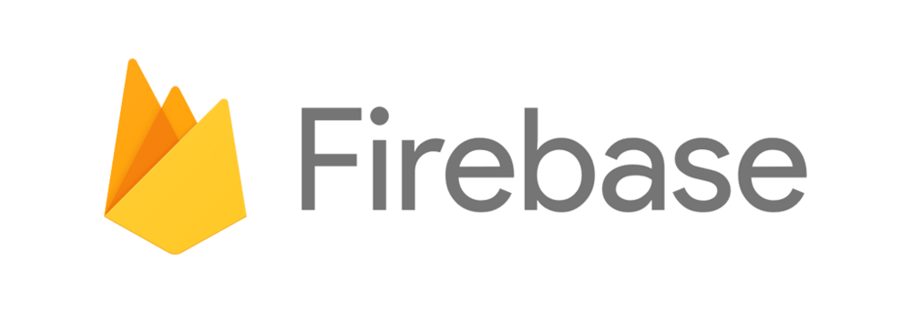

# 日報システムとセキュリティ
世界的に有名な企業であっても、情報漏洩を防ぐことができません。
直近では、Facebookがそうでした。情報は流れる水のごとく、完全に流出を防ぐことは困難です。
それでもセキュリティは妥協してはならない、重要な課題です。

**「Nipoは大丈夫？」**

みなさまがまず最初に思うことです。
このページでは、Nipoのセキュリティに関する情報をまとめました。
技術的な用語はできるだけ補足を加えながらわかりやすく解説していますが、疑問点などがございましたら遠慮なくお問い合わせ下さい

## 堅牢なFirebaseをインフラ基盤としている

NipoのサーバはGoogle社の運営する[FireBase](https://firebase.google.com/)を利用しています。FireBase自体が堅牢なセキュリティをもっております。
FireBaseは、Webアプリやスマートフォンアプリに特化したサーバという特徴があります。そのため、Webアプリに関するセキュリティリスクを大幅に軽減する仕組みが数多く提供されています。
NipoはFirebaseのガイドラインに則り運営されており、これらの安全性を享受しています。以下で詳しくご紹介します

### ユーザアカウントの管理
Webアプリの多くは、ユーザを識別するためのIDとパスワードをサーバ上に保管しています。
FireBaseは、ログインに使用する情報としてIDとパスワードを管理するシステムが提供されています。

::: tip
Googleの持つセキュリティ・アカウントのノウハウをそのままNipoで利用しています
[FireBaseに関する参考資料](https://firebase.google.com/products/auth/?hl=ja)
:::

たとえば、ユーザアカウントにおけるパスワードは、非常に重要で、絶対に流出してはならない情報です。パスワードはFirebaseが完全に管理しており、Nipoの開発者であっても読むことができません。
また、ユーザアカウントにおいて特に重要な設定については、ログイン後一定時間経過すると自動でロックが掛かります。ロックが掛かると、これらの項目は変更ができなくなります。
具体的には、「メールアドレス」「アカウントの削除」が該当します。
ロックを解除するには、一度Nipoからログアウトし、手動でログインし直す必要があります。
メールアドレスの変更が失敗する場合はこのロックによる場合がほとんどです。
万が一、あなたのアカウントを乗っ取るためにログインメールアドレスを変更されたとしても安心です。
ログインメールアドレスが変更されると、変更前のメールアドレス宛に通知が届き、なおかつその受信したメールからワンクリックで、ログインのメールアドレスを変更前に差し戻すことが可能です。

::: warning
心当たりがないのにメールアドレス変更通知が届く場合、悪意のある第三者があなたのアカウントを狙っており、ログインパスワードがバレています。今すぐにログインパスワードを変更して下さい
:::

### 通信の暗号化
サーバと日報のデータをやり取りするために、必ず「通信」が発生します。通信は公共回線のため、傍受などのリスクがあります。
Nipoでやり取りされる通信は[Https化](https://www.bloom-promotion.jp/journal/web-knowledge/http-https-ssl-difference.html)しており、通信のデータが安全に守られています。
HTTPS化については、現在多くのサイトでも行われている基本的なセキュリティ対策です。今、表示されているこのページもHTTPS化されています。

::: tip
HTTPSに対応しているサイトの見分け方は簡単です。ブラウザのURLウインドウを見て、鍵マークがついていればHTTPS化されています
:::

### 日報やコメントなど全てを暗号化して保存
**「重要な情報は暗号化する」**

これは鉄則と言えます。FireBaseでは保存されるデータは[データベース上に暗号化して保存](https://firebase.google.com/support/privacy/?hl=ja#data_encryption)されます。
暗号化に関する仕組みも含めて、全てFirebaseが提供しているため、「弊社の暗号が甘い」といった心配もありません。
::: tip
米国では暗号技術を兵器とみなしており、暗号技術を用いる製品を輸出することは兵器の輸出とみなされます。そのため
本当に堅牢な暗号を独自に実装すると実はApple StoreやGoogle Play Storeにアプリを公開できません。これらは米国から日本へ「輸出」される扱いのためです。
但しHTTPSなど（米国が本気を出せば解読できるレベルの）の暗号であれば簡易的な手続きで輸出が可能となります
:::

### 強固なユーザ対応アクセス制限
全てのアクセスを閉じることで、データは安全です。しかし入り口がなくてはデータにアクセスできず、システムとして使えません。

**「正式なユーザだけがデータにアクセスできる」**

ことが要求されます。
言葉でいうのは簡単ですが、ここがセキュリティ上、非常に難しい点です。プログラム中にバグが混入しやすく、情報流出に繋がります。
Firebaseではデータのアクセス制限を「プログラムとは別に」提供しています。
「プログラムとは別」のため、もしNipo本体にバグが有ったとしても、アクセス制限のルールは影響を受けません。
この機能はFirebase内ではSecurity Rule（セキュリティ・ルール）と呼ばれています。

::: warning
なお、Nipoでは「グループ」がセキュリティ・ルールの単位となります。
:::

### No-SQLデータベース
広く一般的に使われているデータベースは、リレーショナルデータベース（以下RDB）と呼ばれるタイプのものです。
RDBでは、SQLインジェクションなどの攻撃手法が確立されており、この攻撃を防ぐにはシステム開発者が入念な安全チェックを行う必要があります。

::: tip
SQL-インジェクションとはRDBでデータを取り出す際に書く命令を、意図的に誤作動させて行う攻撃手法のことです
:::

対するNo-SQL型のデータベースは、近年広く普及している新しいデータベースです。
NipoはFirebaseが提供するNo-SQL型データベース[FireStore](https://firebase.google.com/products/firestore/)を利用しており、SQLインジェクションなどの攻撃が、構造上そもそも受けません。

::: tip
ホームページの世界でもWordperssなどを使ったサイトがかなり多くありますが、WordpressはRDBを使っています。
安心してください。今見ているNipoのホームページは静的（Static Site）で、仕組み上セキュリティリスクが極端に低いです
:::

### 過去10日分までのデータをバックアップ
お客様からお預かりしている日報のデータは、毎日バックアップをとっています。
過去１０日分までを取得し、古いバックアップは適時消去されます。
バックアップのデータはFireBaseではなく、同じGoogle社が運営する、GCP上に保存されています。

## 開発環境について
データの漏洩は、主に外部からの不正アクセスによる場合と、社内からの内部不正アクセスがあります。この章は主に後者に対する対策について記述しています

### Firebaseにアクセスできる人間は１名しかいません
Nipoの開発において、Firebaseの内部にアクセスできるスタッフは管理者１名だけです。ログインできる人間は少ないほど安全だということは、言うに及びません。
私生活においても「秘密」を知る人は少ないほうが良いのは容易に想像ができますね。

### 開発用ＰＣはセキュリティ対策ソフトを実装
コンピュータウイルスによる被害を防ぐため、Nipoの開発に使うコンピュータはセキュリティ対策ソフトが導入されています。
開発実機は現在2台（Windows10が1台・Mac OSXが1台)あり、すべて最新のバージョンで使用しています。

## 正しく安全に使うには、あなたの努力も必要です
セキュリティについては、開発側が行うセキュリティは当然として、もう一つ、システムを使う側もセキュリティに対する意識を持つことが重要です。

医者がいくら、「タバコは体に悪いからやめろ」と言っても、たばこを続ける・やめるを決めるのは患者自身です。

システムもこれと同じ。
どんなに堅牢な守備を誇るシステムだって、ログインパスワードに０６０３（だれかの誕生日）なんて使われてたら簡単に突破されてしまいます

画像出展：[独立行政法人IPA](https://www.ipa.go.jp/security/keihatsu/munekyun-pw/)

## 本サイトのセキュリティ対策について
NipoはFirebase上にホスティングされており、本サイトはnetlify上にホスティングされております。そのため直接的な関係はありませんが、本サイトのセキュリティ対策についても補足としてご紹介します。
このサイトは静的HTMLを利用しており、その構造上セキュリティ・ホールが生まれにくく非常に高速・非常に安全なサイトとなります。