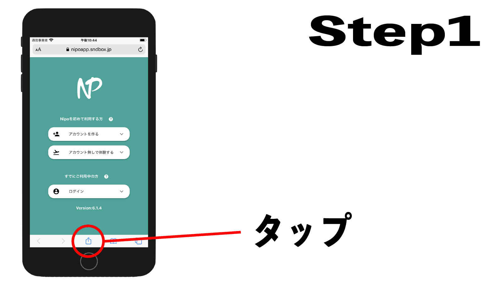
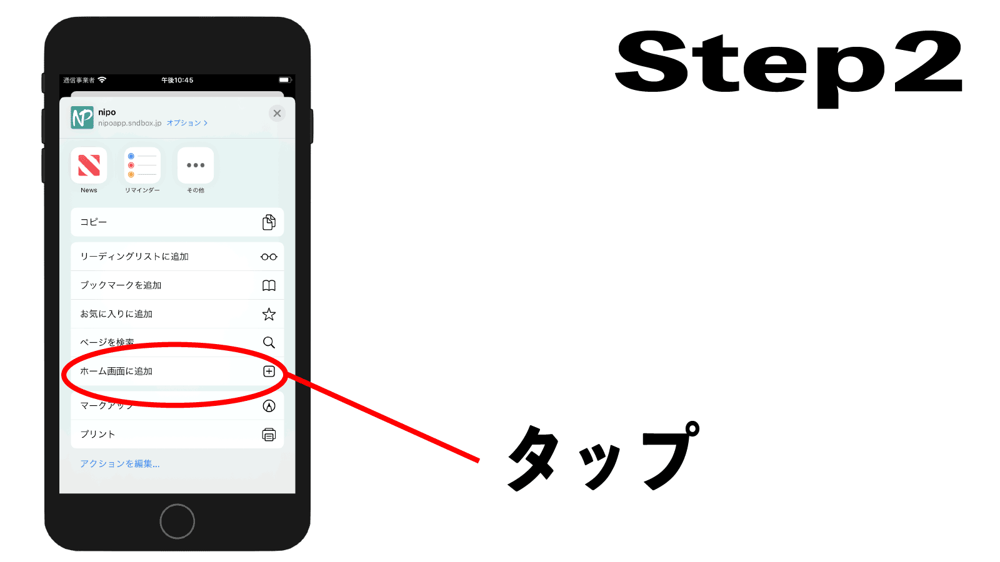
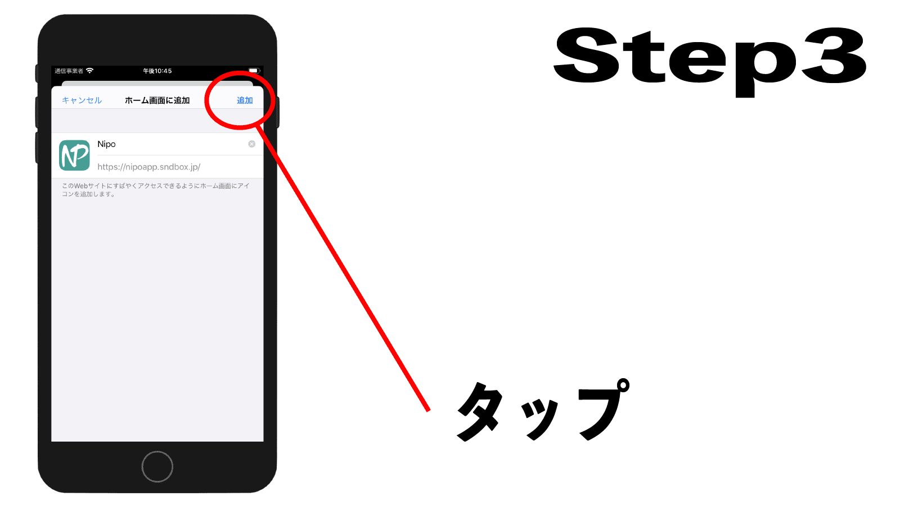
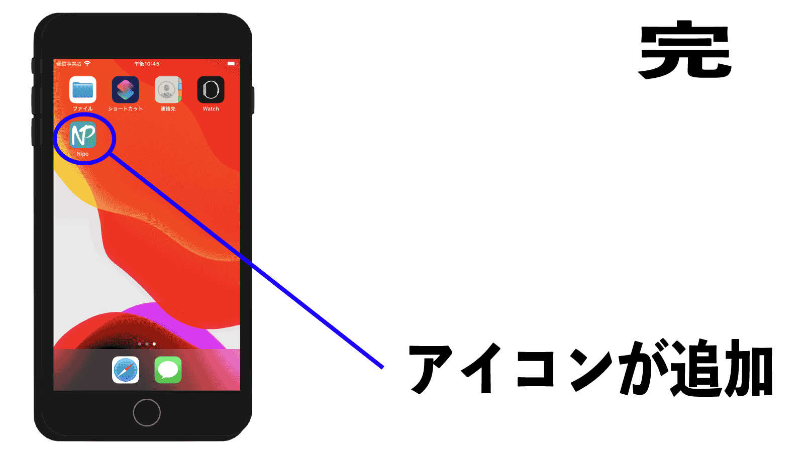

# iPhone・iPadでNipoを使う
NipoはPWA(プログレッシブ・ウェブ・アプリ)という技術を採用して作成されました。  
かんたんに説明するとPWAとは、普通のWebページをあたかも「アプリケーション」風に見せる技術です。
[[toc]]
## PWAとしてインストール(推奨)
PWAがまだ一般的に浸透していないため、インストール手順に戸惑う方もいることでしょう。  
安心してください。インストールはとてもかんたんです。手順はたったの３つしかありません。  
まず以下のボタンからNipoを起動します。

::: tip 必ずSafariで操作してください
Safariは方位磁石のデザインのアイコンで、購入時から予めインストールされています。
:::

<ExeButton label="Nipoを起動" url="https://nipoapp.sndbox.jp/" />

Nipoのログイン画面が表示されましたね。  
ここからは図で解説します。下の図を参考に操作してください

お疲れさまでした。これでNipoをPWAとしてインストールできました。  
<Alice label="案ずるより産むが易しってね" icon="tablet" />

### PWAインストール手順（動画）

操作手順がわかりにくい方向けに動画によるインストール紹介手順も用意しております。  
1分20秒ほどの動画ですが、手順を確認できます。（音声は出ません）

    <iframe width="1000" height="720"
      src="https://www.youtube.com/embed/1qSTeHoF1XA" frameborder="0"
      allow="accelerometer; autoplay; encrypted-media; gyroscope; picture-in-picture"
      allowfullscreen>
    </iframe>

## iOSアプリストアからインストール
App StoreからNipoをインストールする手順です。  
多くの方はこちらの手順に慣れていると思います。  

PWA版と比較すると、一部の機能が制限されています

## PWA版とアプリストア版の違い
PWA版は「ブラウザ上」で動作しますが、URLバーなどが非表示となり、見た目が通常のアプリと遜色ありません。  
デスクトップにもアイコンが追加され、一見するとPWA版もアプリストア版も同じように見えます。  
さらに大元となるプログラムはどちらも同じもののため、日常の利用において両者の差はほとんど感じることができません。
PWA版は必要なプログラムをブラウザ上に保存します。アプリストア版は「インストール」という形で必要なプログラムを端末に保存します。  
そのためかかる通信量も両者ともにほとんど変わりません。

差が生まれるのはアプリのアップデート時です。  
アプリストア版はアプリストアからアップデートする必要があります。対するPWAは更新があると自動でアップデートが適用されます。